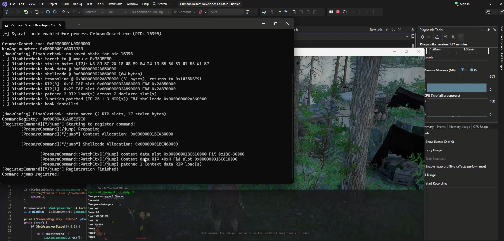

# Crimson Desert Developer Console Enabler ( + Custom Console Command Registry)

External tool that re-enables Crimson Desert's built-in Pearl Abyss Engine developer console and lets you register your own custom console commands at runtime.



## How it works

- Attaches to the running `CrimsonDesert.exe` process externally (no DLL injection into the game process).
- Detours the engine's dev-mode disabler function so `ShowDebugConsole` become usable again. (`HideDebugConsole` Isn't working currently )
- Allocates a small shellcode stub + context struct in the target process and hooks the game's internal `RegisterCommand`-style handler descriptor to register brand new console commands (not just unlock existing ones).
- Ships an example `/jump` command that offsets the player's position (`CPosition`) by a configurable height.

Toggle the console in-game with the middle mouse button (`GetAsyncKeyState(4)`).

## Project layout

| Folder | Purpose |
|---|---|
| `External/` | Main external tool — entry point, hooking logic, command registry |
| `External/Include(Source)/External/WinAppLauncher.*` | Finds/patches the dev-console disabler, shows/hides the console |
| `External/Include(Source)/External/CommandRegistry.*` | Allocates & registers custom console commands in the remote process |
| `External/Include(Source)/External/CPosition.*` | Reads/writes the local player position |
| `GlobalData/` | Shared globals (process/module handles) used across modules |
| `Math/` | Minimal math types (`Vector`, etc.) |
| `LiquidHookEx/` | External hooking library (git submodule) — process/module abstraction, detours, remote memory alloc/write |

## Dependencies

- [LiquidHookEx](https://github.com/xsip/LiquidHookEx) — external hooking library, pulled in as a git submodule.
- Windows, MSVC (v145 toolset), C++20.

## Building

```bash
git clone --recurse-submodules <this repo>
```

Open `CrimsonDesert-Developer-Console-Enabler.slnx` in Visual Studio 2022+, pick `Release|x64` - Debug wont work - and build.

If you already cloned without `--recurse-submodules`:

```bash
git submodule update --init --recursive
```

## Usage

1. Launch Crimson Desert.
2. Immediatly Run the built `External.exe` (as external tool — it attaches to the already-running game process).
3. Wait for it to hook the dev-mode disabler and allocate the console.
4. Press **middle mouse button** in-game: first press registers the example `/jump` command, subsequent presses toggle the dev console.
5. Use registered commands from the in-game dev console.

## Adding your own commands

Write a `__fastcall` function taking no visible arguments plus a matching `...End()` sentinel function (used to compute shellcode length), define a context struct for whatever data the command needs, then call:

```cpp
pCmdReg->RegisterCommand<MyCtx>("/mycommand", MyFn, MyFnEnd, &g_pMyCtx, ctx);
```

See `External/Main.cpp` for the full `/jump` example.

## Disclaimer

For educational/reverse-engineering purposes on your own local game installation. Use at your own risk; may violate the game's terms of service — do not use in multiplayer/online contexts.
